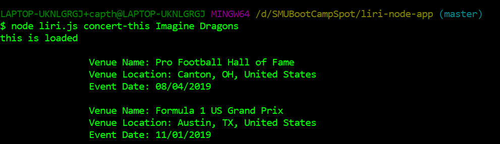
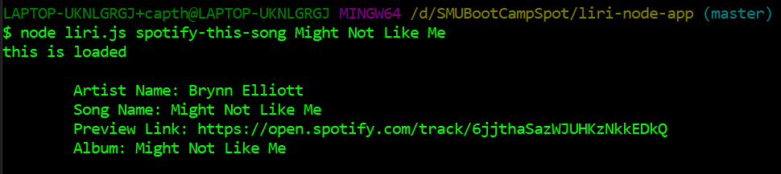
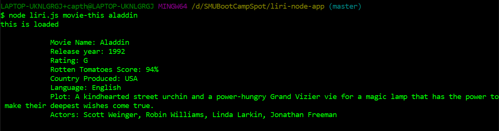
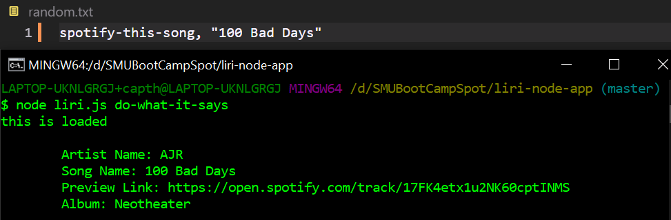
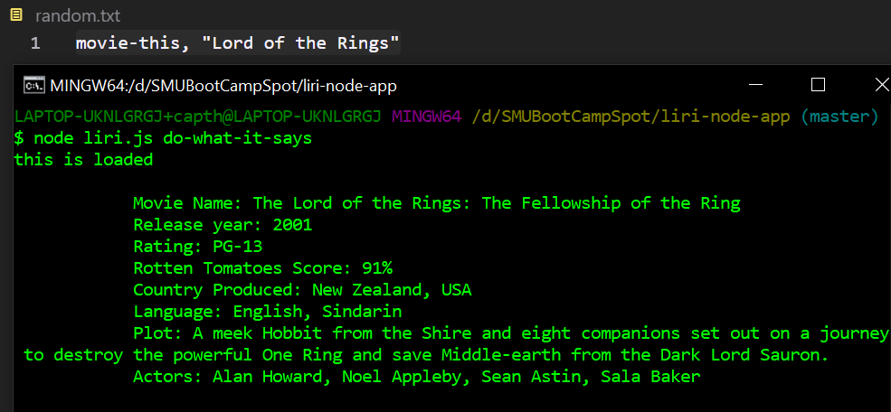
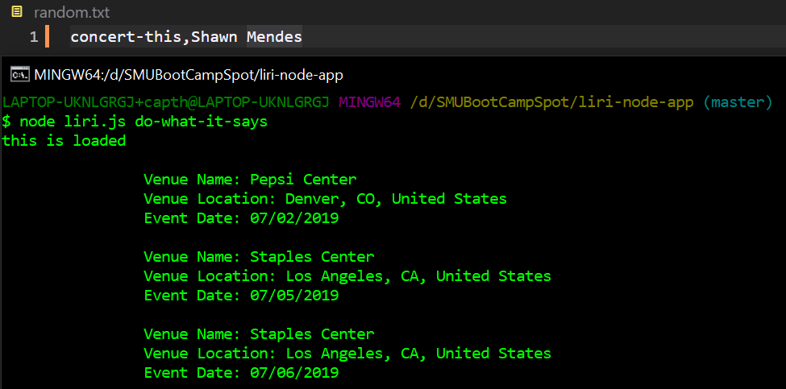
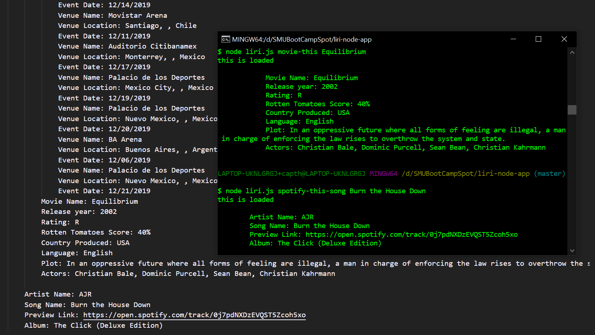

# liri-node-app

## Goal of the app

Allow a user to look up upcoming concerts, songs, and movie information.

The commands used in order to find this information is:

1. concert-this
2. spotify-this-song
3. movie-this

## *Using the app*

Using git or terminal, navigate to the folder containing the file liri.js.

input: npm install

You must supply your own spotify env as the one to create this app is hidden and will not work on your machine.  Put the information in a file called .env.  In that file, type in the following information:

SPOTIFY_ID=*YourSpotifyID*

SPOTIFY_SECRET=*YourSpotifySecret*

Before inputting any of the following commands, you must type in: node liri.js

As an example: node liri.js concert-this Imagine Dragons

### **Concerts**

To look up information on an artist and their upcoming concerts, type in "concert-this artist" where artist is the name of the band or artist that you are wanting.

The information returned will be:
* Name of the venue
* Location of the venue (city, state, country)
    * If there is no state it will show as "city, , country"
* Date of the event.

An example:

### **Songs**

When you want to look up information regarding a song, the command is "spotify-this-song songName" where songName will be the name of the song.

This will return:

* Artist Name
* Song Name
* Preview Link from Spotify
* Album

An example:

### **Movies**

If you want to look up information about a movie, use the command "movie-this movieName" where movieName is the name of the movie you want to look up.

This will return:

* Movie Name
* Release Year
* Movie Rating
* Rotten Tomatoes Score
* The country it was produced in
* The language
* A short synopsis of the plot
* The lead actors and actresses

An example:

### **Do What It Says**

Using the command "do-what-it-says" will read the file "random.txt" and use the information from that to run the other commands.  So, if you have "spotify-this, 'Sexy Back'" it will run the command "spotify-this, Sexy Back".

Similarly, if you have "movie-this, movie" in the "random.txt" file it will run the movie-this command.

Finally, if you type in "concert-this,artist" in "random.txt" it will run the command for concert-this.  If you notice, you can **not** have a space between the command concert-this and artist.  If you do, it won't return any information.  The other two, the space is accepted in the search.

### **Appending to File**

After you run a command, the output will be appended to the file "log.txt".  It does not overwrite the information, so if you want to look at your most recent search, you'll have to scroll to the bottom of the file.

Example:
 

As shown in the example, the log.txt continues to build on all the previous searches and the file begins to grow and grow.  The concert-this command returns a lot of information depending on the artist.